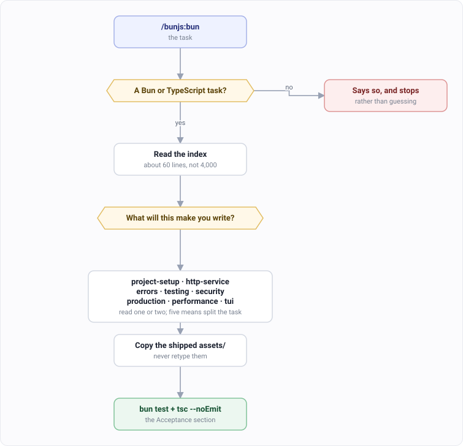

# bunjs: step by step

One entry point for any Bun or TypeScript work.

What the plugin ships is on the [bunjs plugin page](../plugins/magus/bunjs.md).

---

## `/bunjs:bun` — the only command you need to remember

### Step 1. Describe the task, not the skill

```
/bunjs:bun add rate limiting to the API
/bunjs:bun the server drops requests on deploy
/bunjs:bun review this OpenTUI dashboard
```

Don't name a skill. It routes on **what the task will make you write**, not on the words you
used. "Add login" is a security task. "It's slow" is a performance task. Neither request
names a skill, and it doesn't need to.

### Step 2. It reads the index, then one or two skills



Two skills is normal. Five means the task should be split up.

### Step 3. Copy the shipped code

Six of the eight skills ship tested code in an `assets/` directory, and each one gives you
the exact `cp` line.

Use it. Don't retype it.

Retyped versions lose the parts that are easy to miss and hard to debug — the timing burn in
the password comparison, the full-jitter backoff, the cycle-safe walk through error causes.

### Step 4. Check it against the Acceptance section

Every skill has one, and it's the definition of done. `bun test` plus `tsc --noEmit` is the
floor in all eight.

`tsc --noEmit` isn't optional here. `bun run` strips types without checking them, so a type
error never shows up at runtime. It shows up in production, as something else.

---

## The eight skills

You don't pick these. This is what the router is choosing between.

| Skill | For | Ships |
|---|---|---|
| `project-setup` | Structure, strict tsconfig, typed env config, workspaces | env parser + 24 tests |
| `http-service` | `Bun.serve` routes, middleware, response shape, streaming | middleware + 38 tests |
| `errors` | Validation, retry, timeout, circuit breaker | AppError + 53 tests |
| `testing` | `bun:test`, doubles, coverage gating, flaky tests | harness + 30 tests |
| `security` | Passwords, tokens, injection, rate limiting, CORS, headers | guards + 51 tests |
| `production` | Graceful shutdown, logging, health checks, Docker, CI | logger + 29 tests |
| `performance` | Profiling, benchmarking, event-loop blocking | bench harness + 18 tests |
| `tui` | OpenTUI terminal UIs and dashboards | theme + 119 tests |

### What it reads, for what

| Your task | It reads, in this order |
|---|---|
| A new service from scratch | `project-setup` → `http-service` → `errors` |
| "add auth / login / signup" | `security` → `errors` |
| "build an API endpoint" | `http-service` → `errors` |
| "write tests", "fix this flaky test" | `testing` |
| "get it deployed", "the deploy drops requests" | `production` |
| "it's slow" | `performance` |
| A terminal UI or dashboard | `tui` |
| "review this for security" | `security` → `errors` |

Chains stop where the task stops. "Create a todo app" is
`project-setup` → `http-service` → `errors`. `testing` waits until there's something to
test. `security` waits until it has users. `production` waits until you're shipping it.

---

## Option: call a skill directly

If you already know which one you want:

```
/bunjs:testing
/bunjs:security
```

## Combine it with the other plugins

`bunjs` is knowledge, not a workflow. It has no phases, no gates and no agents — so it slots
underneath the commands that do.

| Want | Run | What bunjs adds |
|---|---|---|
| A feature built properly | [`/dev:dev`](./dev-build.md) | The Bun patterns the implementation phase writes to |
| A bug fixed test-first | [`/dev:fix`](./dev-debug.md) | How to write the failing test, and the error handling around the fix |
| A design decided first | [`/dev:architect`](./dev-architect.md) | What a Bun service actually looks like, so the design is buildable |
| A second opinion | [`/multimodel:team`](./multimodel.md) | Nothing — but ask it to judge against the Acceptance sections |

You do not wire this up. `dev` detects the stack, and on a Bun project its agents reach for
these skills on their own.

Ask directly when you want the knowledge without the process:

```
/bunjs:bun add rate limiting to the API          knowledge, applied now
/dev:dev add rate limiting to the API            phases, review gates, tests
```

The first is faster. The second is what you want when the change matters enough to be
reviewed.

---

## Two things that surprise people

**Only the index shows up in your skill list.** The other eight are hidden from it on
purpose. That list has a budget of 8,000 characters shared across every plugin you have
installed, so eight more entries would push someone else's skills out to buy something the
router already does.

**All eight together are about 4,000 lines.** Reading them for every task would be slower and
worse than reading none. The index costs about 60 lines to consult, and that's the trade.

---

## It only knows Bun

The skills are verified against Bun, and nothing else. On Node or Deno, treat them as a
starting point rather than a reference.

If the task isn't Bun or TypeScript at all, `/bunjs:bun` says so and stops. It doesn't
improvise.
