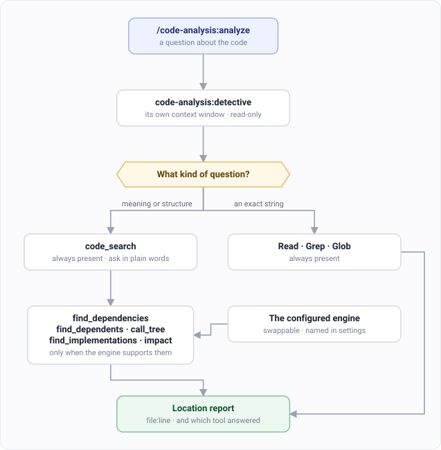

# code-analysis: step by step

For code you didn't write. Or wrote long enough ago that it counts.

What the plugin ships is on the
[code-analysis plugin page](../plugins/magus/code-analysis.md).

---

## `/code-analysis:analyze` — find out how something works

### Step 1. Ask a specific question

```
/code-analysis:analyze Where is user authentication handled?
```

Be specific. "Analyze the codebase" gets you a tour. "Where is the email validation logic"
gets you a file and a line number.

Mention why you're asking, too. Debugging, refactoring and learning need different answers
to the same question.

### Step 2. It picks its tools



The detective runs in its own context window and has no ability to write. An investigation
can't turn into a refactor you didn't ask for.

### Step 3. Read the location report

```
Location Report: [what was analyzed]

Primary files
  path/to/file.ts:45-67    what it does there

Code flow
  1. Entry point       file:line
  2. Processing        file:line
  3. Result            file:line

Related components
Recommendations
```

File paths and line numbers, not descriptions. That's the difference between a tour and
something you can act on.

### Step 4. Drill in

Ask a follow-up about one file. The first answer is meant to orient you, not to be the last
word.

---

## Option: index the repo first

You don't have to. It works either way. But the two paths don't answer equally well.

| You ask | Text search gives you | The index gives you |
|---|---|---|
| where is `createUser` defined | every file with that string in it | the definition, and how central it is |
| what calls this | call sites, plus comments, plus the docs | the call graph |
| what breaks if I change this | nothing — you can't grep for that | the blast radius |
| where is auth handled | files with "auth" in them | files that *do* authentication, whatever they're called |

That last row is the interesting one. A file called `session-guard.ts` with no occurrence of
the word "auth" is invisible to grep and obvious to a semantic search.

### To set it up

```
/code-analysis:setup
```

It checks the setup and writes the mnemex tools into your project's `CLAUDE.md`.

Indexing needs an [OpenRouter](https://openrouter.ai) key for the embedding model. Run
`mnemex --models` to see the choices and what they cost.

The index lives in `.mnemex/`. It's specific to your machine and can be rebuilt any time, so
put it in `.gitignore` and never commit it.

---

## Which command to use

| You want | Use |
|---|---|
| To understand code | `/code-analysis:analyze` |
| The same thing, with modes, through `dev` | [Understanding code](./dev-investigate.md) |
| To find *and fix* a bug | [Fixing a bug](./dev-debug.md) |
| To change code you already understand | just ask |

`/dev:investigate` is a thin wrapper over this same detective. Use whichever name you
remember. Both are read-only, so neither will change anything while you're still working out
what to change.
