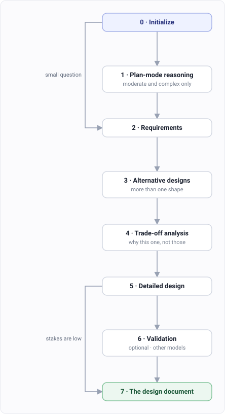

# Designing before you build

`/dev:architect` ends in a document, not code.

Use it when the decision is worth more than the implementation — where to put a boundary,
how to shard a table, whether to split a service.

## Step 1. Turn on plan mode first

This one is worth doing, and it's easy to skip.

Plan mode makes Claude Code think the problem through before it touches anything. For an
architecture question that's exactly the mode you want, because the expensive mistake is a
decision made too fast, not code written too slowly.

`/dev:architect` will enter plan mode itself for moderate and complex questions — that's
Phase 1 below. Turning it on yourself first still helps: you get to shape the problem before
the command starts, and what you work out becomes input to every phase after it.

## Step 2. Ask the design question

```
/dev:architect how should we shard the events table
```

Say what's actually constraining you. Read volume, team size, what you already run in
production. Trade-off analysis without constraints is just a list of options.

## Step 3. It proposes more than one design



Phases 3 and 4 are the reason to use this instead of thinking out loud.

One design with a rationale attached is a decision that's already been made. Two or three
designs with their trade-offs is a decision you can still review.

## Step 4. Decide whether to escalate

Phase 6 sends the design to other models for a second opinion. It only offers this when the
decision is expensive enough to be worth it.

A small question skips plan mode and most of the ladder. You won't get eight phases for
"should this be a util or a method".

## Step 5. Hand the plan to `/dev:dev`

You have a design. Don't let it get planned again.

```
/dev:dev implement the sharding plan
```

Pick **quick** depth. Quick runs stack detection then goes straight to implementation — it
skips the planning phase entirely and builds from the plan already in your context.

At standard or full depth you'd pay for planning twice, and the second pass can quietly
drift from what you just decided.

> **This is a choice you make, not something detected for you.** Picking quick is what tells
> `/dev:dev` to trust the plan you already have instead of making its own.

## What you get

A design document with the alternatives, the trade-offs, and the chosen shape in enough
detail to build from.

## Not what you wanted?

| You want | Guide |
|---|---|
| To build it now | [Building a feature](./dev-build.md) |
| To understand what's already there first | [Understanding code](./dev-investigate.md) |
| A second opinion from other models | [multimodel](./multimodel.md) |
