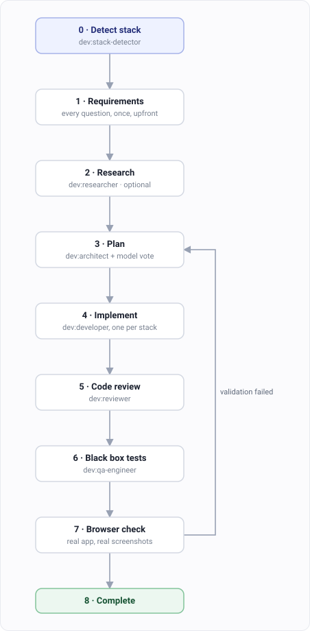

# Building a feature

`/dev:dev` builds a feature through up to nine phases. It's an orchestrator — it works out
your stack, hands each phase to a specialist subagent, and checks the result before starting
the next one.

## Step 1. Say what you want built

```
/dev:dev add rate limiting to the public API
```

## Step 2. Pick a depth

Depth decides how many of the nine phases run.

| Option | Phases | Pick it when |
|---|---|---|
| **quick** | 0 → 4 | You could describe the change in one sentence, or you already have a plan |
| **standard** | 0 → 3 → 4 → 6 → 8 | Normal feature work |
| **full** | all nine | You can't afford to get this wrong |

Nothing is skipped quietly. The task list is built after you choose, so you can see which
phases were dropped.

## Step 3. Pick how often it stops

| Option | What happens |
|---|---|
| **interactive** | Asks at every decision |
| **guided** | Asks at the phase boundaries that matter |
| **autonomous** | Runs through, and stops only when it's genuinely stuck |

## Step 4. Answer the setup questions once

At full depth, Phase 1 asks everything upfront — what "done" looks like, how to validate,
which URL to test. One batch, then it runs.

## Step 5. Let it run



Watch the arrow from Phase 7 back to Phase 3. A failed browser check doesn't get patched in
place. It goes back to planning, with the failure as input.

`retry_limit` bounds that loop. When it runs out you choose: accept where it got to, add
more iterations, run unbounded, take over yourself, or stop.

## If you already made a plan

Worked something out in plan mode, or ran [`/dev:architect`](./dev-architect.md)? Run
`/dev:dev` at **quick** depth.

Quick goes straight from stack detection to implementation. It skips the planning phase
entirely and builds from the plan already in your context, instead of planning the same
thing twice.

## Choosing the review models

At standard and full depth, the plan and the finished code are reviewed by **other models**,
not just by the one building. That runs through the
[multimodel](./multimodel.md) plugin and its claudish MCP server.

You are asked **once**, in Phase 1. The team you pick is stored and reused for both the plan
review and the code review, so you are not asked again halfway through.

Three ways to answer:

| Say | You get |
|---|---|
| nothing | A team composed for the task from the live catalog |
| "use top tier models" | The most capable available, at the highest cost |
| a family — "grok, gemini" | Those resolved to their current IDs |

Each candidate is shown with its quality, speed and cost, so "top tier" is a decision you
make with the numbers in front of you.

**Which models exist right now:** <https://models.madappgang.com/recommended>

Names are resolved against that live catalog every run, never from a list baked into the
plugin. Model IDs turn over fast, and a dead one behaves like a slow request rather than an
error — so nothing here is hardcoded.

To stop being asked at all, pin the team in your preset:

```json
{ "review_models": ["internal", "grok", "gemini"] }
```

`internal` means the model you are already talking to. Including it gives you one reviewer
that has the session's context and two that do not, which is usually what you want.

## Option: stop it asking the same things every time

Answer once in a preset file and it skips those questions.

Start with the two you'd otherwise answer every run:

```json
{
  "depth": "standard",
  "automation": "guided"
}
```

That's a complete preset. Every key is optional, and anything you leave out, it asks about
as usual.

Add more only when you need them:

| Want | Add |
|---|---|
| Tests only, no browser | `"validation": "unit-tests-only"` |
| Test against your running app | `"validation": "real-browser-test"`, plus `test_url` and `dev_server` |
| Compare against a design | `"validation": "screenshot-comparison"`, plus `design_file` |
| Hit an endpoint instead | `"validation": "api-endpoint-test"`, plus `test_url` |
| Fewer retries before it asks you | `"retry_limit": 3` |
| A fixed review team | `"review_models": ["internal", "grok"]` — see above |
| Work in a fresh directory | `"workspace": "new-directory"` |

So a real one for a web app looks like this:

```json
{
  "depth": "full",
  "automation": "autonomous",
  "validation": "real-browser-test",
  "test_url": "http://localhost:3000",
  "dev_server": "bun run dev"
}
```

## What it needs

Phase 7 drives a real browser through the `chrome-devtools` MCP server, which you set up
yourself. Without it, pick `unit-tests-only` and that phase is skipped.

The review gate in Phase 3 uses other models through `claudish`, which comes with `dev` when
you install it through [claudeup](./install.md).

## Not what you wanted?

| You want | Guide |
|---|---|
| To fix a bug | [Fixing a bug](./dev-debug.md) |
| To decide the design first | [Designing before you build](./dev-architect.md) |
| To understand the code, not change it | [Understanding code](./dev-investigate.md) |
