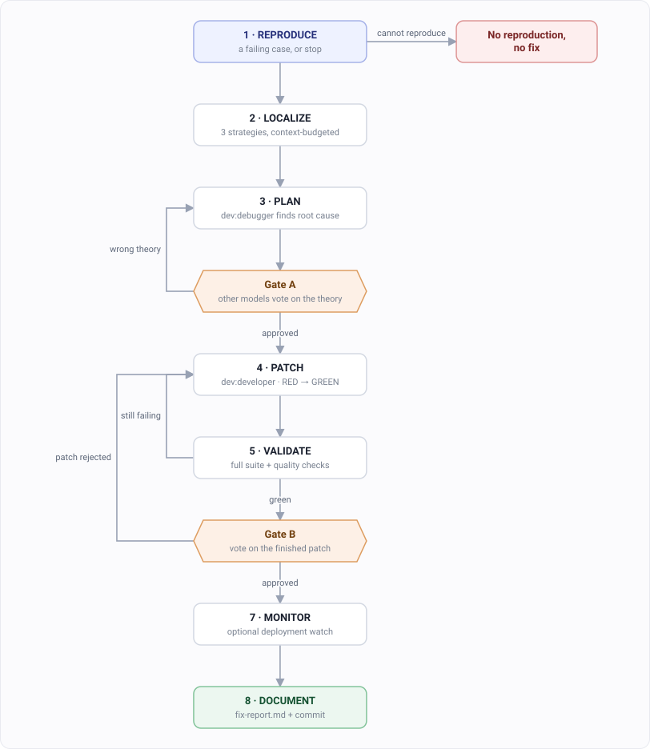

# Fixing a bug

The failure mode for a bug fix isn't "unfinished". It's "fixed the symptom and shipped it".

So `/dev:fix` is test-driven, and other models check it twice.

## Which command

| Your situation | Use |
|---|---|
| Something's broken and you know roughly where | `/dev:debug` |
| Something's broken in production, or the cause isn't obvious | `/dev:fix` |
| You only want to understand what's happening | [`/dev:investigate`](./dev-investigate.md) |

`/dev:debug` is the light option — a quick inline patch or a standard debug pass. Everything
below is about `/dev:fix`, the full treatment. It costs accordingly.

## Step 1. Describe the bug

```
/dev:fix GET /users/:id returns 500 when the user was deleted
```

Give it the error, the endpoint, whatever you have. It works out the rest.

## Step 2. It reproduces the bug, or it stops



No reproduction, no fix. It won't guess at a cause it can't demonstrate.

If the bug only shows up in production, this is where you find that out — early, instead of
after a patch that fixes nothing.

## Step 3. Gate A checks the theory

Before any code is written, other models vote on the root cause.

A wrong theory gets caught while throwing it away is still cheap. That's the whole reason
this gate sits before the patch instead of after it.

## Step 4. The patch is written test-first

RED, verify it's really red, then GREEN.

A test that passes before the fix proves nothing, so it checks the test fails first.

## Step 5. Gate B checks the patch

The second vote compares the finished patch against the theory from Step 3.

A change that passes the tests but doesn't match the diagnosed cause doesn't get through.

Both gates need 2 of 3 by default.

## Step 6. Read the report

You get `fix-report.md` with the root cause and what changed, plus a commit.

## Options

| Flag | What it changes |
|---|---|
| `--interactive` | You approve after the diagnosis, before any code is written |
| `--no-review` | Skips both gates |
| `--unanimous` | Needs 3 of 3 instead of 2 of 3 |
| `--no-monitor` | Skips the deployment watch |

`--no-review` makes it much faster and removes the thing that makes it different from asking
Claude to fix a bug. Use it when you're confident about the cause and just want the
test-first discipline.

## What it needs

Both gates call other models through the [multimodel](./multimodel.md) plugin and its
`claudish` MCP server, which come with `dev` when you install it through
[claudeup](./install.md). Without them, use `--no-review`.

You can ask for top-tier models, or name a family. Which ones exist right now:
<https://models.madappgang.com/recommended>. Picking a team works the same way as it does
for [building a feature](./dev-build.md).

## Not what you wanted?

| You want | Guide |
|---|---|
| To build something new | [Building a feature](./dev-build.md) |
| To find out how the code works first | [Understanding code](./dev-investigate.md) |
