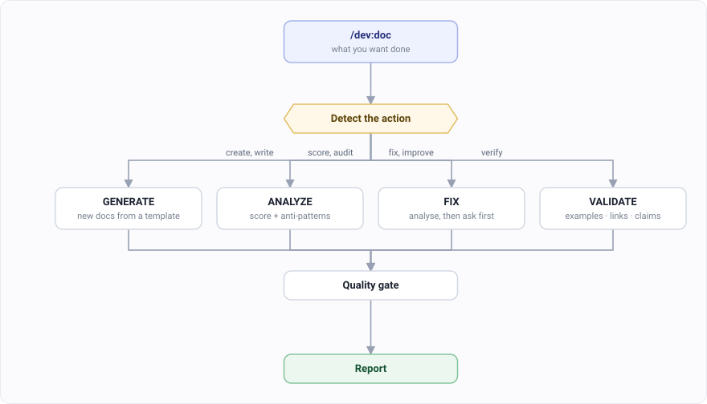

# Documentation

`/dev:doc` writes, scores, fixes or checks docs. One command, four modes.

## Step 1. Say what you want

The wording picks the mode. You don't name it.

| Say | Mode | What happens |
|---|---|---|
| "write a README for…" | GENERATE | New docs from a template |
| "score the docs in…" | ANALYZE | A quality score, plus the anti-patterns it found |
| "fix the API docs" | FIX | Analyses first, shows you, then asks |
| "check the examples still work" | VALIDATE | Examples, links and claims, against the source |

## Step 2. For FIX, approve the changes

FIX doesn't touch a file until it has shown you what it found and you've agreed.

That order matters. A documentation "fix" applied without review is how a wrong claim gets
rewritten into a confident wrong claim.

## Step 3. Read the report

Every mode ends with one, and every mode passes through a quality gate first.

## Which mode for what

| Your situation | Say |
|---|---|
| New project, no docs | "write a README" |
| Docs exist, quality unknown | "score the docs" |
| You know they're stale | "fix the docs in docs/" |
| You suspect the examples rotted | "check the examples in the README still work" |

Start with ANALYZE if you're not sure. It changes nothing and tells you whether the rest is
worth running.

## Not what you wanted?

| You want | Guide |
|---|---|
| To understand the code the docs describe | [Understanding code](./dev-investigate.md) |
| A design document, not user docs | [Designing before you build](./dev-architect.md) |
