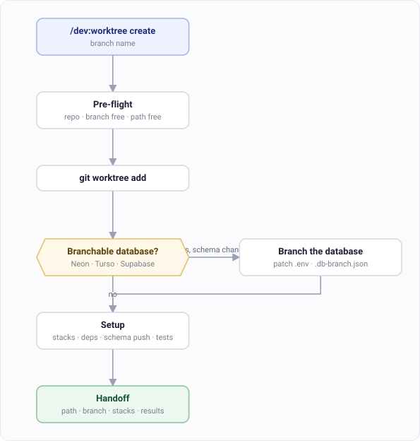
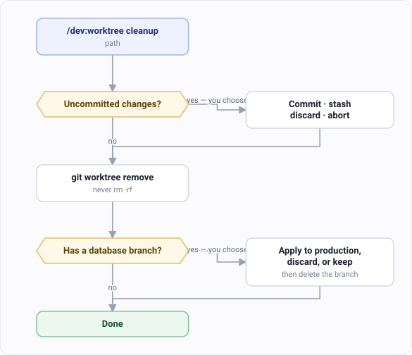

# Isolated worktrees

`/dev:worktree` wraps `git worktree` and automates the parts people forget.

The reason to use it instead of `git worktree add` is **database branching**.

## Step 1. Create the worktree

```
/dev:worktree create feature/billing
```



## Step 2. Answer the database question

If your `.env` points at Neon, Turso or Supabase, it asks whether this branch changes the
schema.

Say yes and it branches the database too — creates the branch, patches `.env` with the new
connection string, records it in `.db-branch.json`, and runs your schema push against the
branch.

Your schema changes then can't reach the database your main checkout is pointed at.

Say no and it shares the database, which is what you want for a change that doesn't touch
the schema.

## Step 3. Work in it

```
cd .worktrees/billing
```

It already installed dependencies for every stack it found, and ran your tests once. So you
know what was broken before you started, which saves an hour of blaming yourself.

## Step 4. Clean up when you're done

```
/dev:worktree cleanup .worktrees/billing
```



It asks twice, and both answers are yours:

- **Uncommitted changes** — commit, stash, discard, or stop.
- **The schema** — apply it to production, discard it, or keep the branch.

Only then does it delete the database branch.

It never runs `rm -rf` on a worktree. Always `git worktree remove`.

## The other subcommands

| Command | What it shows |
|---|---|
| `/dev:worktree list` | Every worktree, with its database branch |
| `/dev:worktree status` | The one you're in |
| `/dev:worktree help` | All of them |

## Without a branchable database

It still works. You get pre-flight checks, dependency install for every detected stack, a
baseline test run, and a cleanup that checks for uncommitted work before removing anything.

The database step is skipped, and it says so rather than asking a question that has no
answer.
