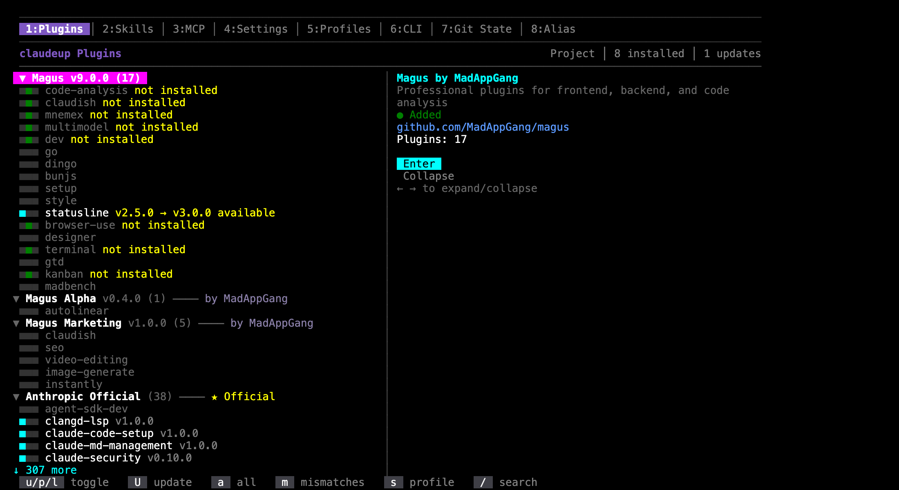

# Installing Magus

**[claudeup](https://www.npmjs.com/package/claudeup) is the way in.**

## Why not just use Claude Code

Claude Code can add a marketplace and enable plugins on its own. For one person, on one
machine, on one project, that is fine — and it is what claudeup drives underneath.

It stops being fine in three places.

**A team can't share it.** You can commit the list of plugins. You cannot commit the things
those plugins need to actually run: the binaries an MCP server shells out to, CLI tools,
skills, the environment variables it wants. A new teammate clones the repo, opens Claude
Code, and gets a plugin that loads and then fails on a missing binary. Somebody walks them
through it. Then the next person joins.

**Updates don't converge.** Plugins are installed per project. Update one project and the
others stay where they were, with no single place that tells you which version each is on.
Two projects on the same plugin at different versions is the normal state, not an accident,
and nothing surfaces it.

**When it breaks, there is nothing to look at.** The state lives across several files Claude
Code owns — a marketplace registry, an installed-plugins registry, `enabledPlugins` at two
scopes, and a content cache. When a hook stops firing or a plugin quietly does not load, the
fault is in one of those and you get no error saying which.

claudeup answers all three: one committed manifest that installs everything a plugin needs,
one command that reports and repairs the state, and updates you can see across projects.

## 1. Install claudeup

```bash
bun add -g claudeup
```

npm works too:

```bash
npm install -g claudeup
```

You get a self-contained binary for your platform. On a platform with no prebuilt binary the
launcher runs from source under Bun, so the install still works.

**Update through claudeup, not your package manager:**

```bash
claudeup upgrade
```

Two verbs, the same split every package manager uses. `claudeup upgrade` advances
**claudeup itself**. `claudeup update` advances **your dependencies** — it installs
whatever your active profile declares but this machine is missing, and moves every
`"latest"` plugin, CLI tool and skill to its newest published version.

```bash
claudeup update           # install what's missing, advance what's behind
claudeup update --check   # report only; exits 1 if anything is out of date
```

## 2. Pick your path

Two ways to use it, and they answer different questions.

### Solo — the TUI

```bash
claudeup
```

That is the whole thing. `claudeup` with no arguments opens the interactive TUI: toggle
plugins, MCP servers and skills on this machine, see what each one needs, and install the
binaries it depends on.



The Magus marketplaces are listed even before you add them. Select one and confirm, and
claudeup clones and registers it for you. Press `n` for the same menu, or to be pointed at
the terminal command for a marketplace it does not know about.

Numbers switch tabs: `1` Plugins, `2` Skills, `3` MCP, `4` Settings, `5` Profiles, `6` CLI,
`7` Git State, `8` Alias. `u`/`p`/`l` toggle a plugin at user, project or local scope, `U`
updates one, `/` searches.

### A team — a committed manifest

Write `.claude/profiles.json` once, commit it, and every teammate runs one command:

```bash
git clone <repo> && cd <repo>
claudeup install
```

That registers the marketplaces, installs the pinned plugins, installs the binaries those
plugins declare, installs the skills, prompts for any required environment variables, and
activates the profile.

A plugin id already names its marketplace — `dev@magus`, `seo@magus-marketing` — so
claudeup registers the ones it recognises without you declaring them. Declare a
`marketplaces` block only for a marketplace claudeup does not ship with, or to point a name
at a fork.

See [Teams and profiles](./teams.md) for the manifest format and how switching works.

## 3. Add the statusline

The statusline comes from the [`setup`](../plugins/magus/setup.md) plugin. Enable
`setup@magus`, then:

```
/setup:statusline-install
```

You get the worktree you are in, your plan limits, and the countdown to reset, along the
bottom of Claude Code. Install it per project or globally.

```
/setup:statusline-customize    sections, theme, bar widths
/setup:statusline-uninstall
```

While you are there, `/setup:project` investigates the repository and provisions it, and
`/setup:index-skills` tells you what your installed skills cost you on every turn.

## Without claudeup

If you want the manual path anyway, Claude Code does the marketplace and plugin steps
itself. Inside a session:

```
/plugin marketplace add MadAppGang/magus
```

Then turn plugins on with `/plugin`, or list them in your project's `.claude/settings.json`
under `enabledPlugins`. Plugin IDs carry their marketplace, so qualify them —
`dev@magus`, `seo@magus-marketing`.

You are then on your own for everything around the plugin: binaries, CLI tools, skills,
environment variables, and reproducing any of it on a second machine.

## Checking a setup

```bash
claudeup doctor          # binary deps, profile symlinks, conventions
claudeup doctor --fix    # repair what it can
```

`doctor` exits non-zero when it finds a problem, so it works as a CI check. So does
`claudeup install --check`, which reports drift without writing anything.

## Which marketplace

You are not limited to Magus. claudeup knows about several out of the box and lists them
before you have added anything, so you can browse first and install second.

| Marketplace | What's in it |
|---|---|
| **Magus** | Development plugins — see [Plugins](../plugins/index.md) |
| **Magus Marketing** | SEO, cold email, image generation, video editing |
| **Magus Alpha** | Experimental. Interfaces change, plugins get withdrawn |
| **Anthropic Official** | Anthropic's own plugins |
| **3rd Party** | Plugins by other people, accepted into Anthropic's official directory |
| **Superpowers** | A curated community collection |

Anthropic Official and 3rd Party are the same upstream directory. claudeup splits them into
two lists by who wrote each plugin, so "Anthropic ships this" and "Anthropic accepted this"
are not the same badge.

The marketplaces are independent. Adding one does not give you the others.

### Your own

Add any marketplace claudeup does not ship with — your team's, or a fork. Press `n` in the
TUI, or name it in your profile manifest:

```json
{
  "marketplaces": {
    "acme": { "source": "github", "repo": "acme/claude-plugins" }
  }
}
```

Then teammates get it from `claudeup install` like everything else. See
[Teams and profiles](./teams.md).

## Next

- [Plugins](../plugins/index.md) — what each marketplace carries
- [Teams and profiles](./teams.md) — share one setup across a team
- [Advanced Usage](./advanced-usage.md) — global installs, version pinning, updates
- [Troubleshooting](./troubleshooting.md) — when a plugin does not load
