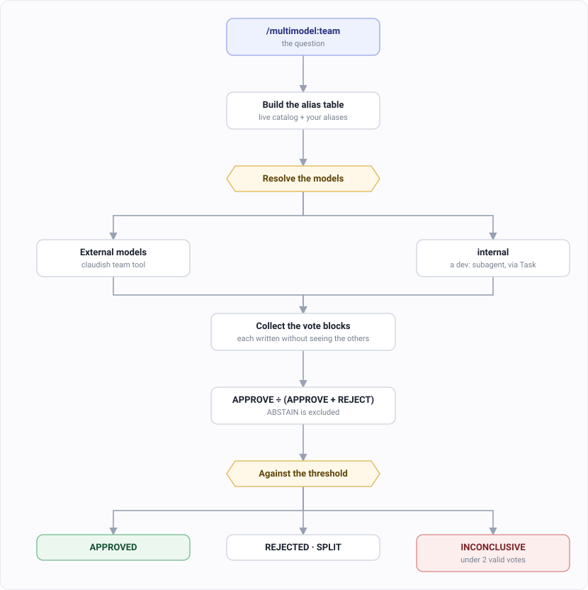
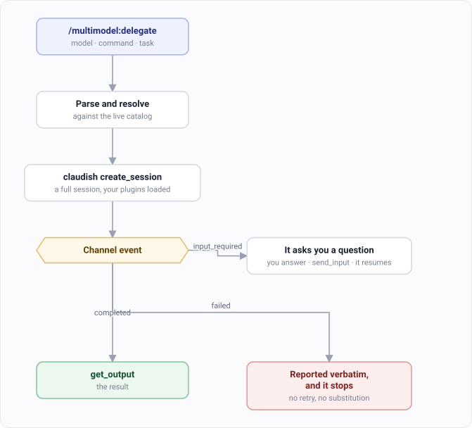

# multimodel: step by step

Two commands. Two different reasons to bring in a model other than the one you're talking to.

| Command | Shape | Use it when |
|---|---|---|
| `/multimodel:team` | Several models, same question, independently | You want a verdict you can trust |
| `/multimodel:delegate` | One model, whole task, full session | You want the work done somewhere else |

Both run on the claudish MCP server. What each command calls is on the
[multimodel plugin page](../plugins/magus/multimodel.md).

---

## `/multimodel:team` — get a verdict from several models

### Step 1. Ask the question

```
/multimodel:team Review the auth implementation
```

### Step 2. Say which models, or don't

You are talking to an agent, so ask for what you want in words:

```
/multimodel:team use grok and gemini — review the auth implementation
/multimodel:team ask the top tier models whether this migration is safe
/multimodel:team get three different providers to check this API for security holes
```

| What you say | What you get |
|---|---|
| Name models — "use grok and gemini" | Those, resolved to their current IDs |
| "top tier" | The most capable available, at the highest cost |
| "three different providers" | A spread, so agreement means something |
| Nothing about models | A team composed for the question, from the live catalog |

It remembers. The team you settle on is saved as your default, so the next run needs no
instruction at all. Say "don't remember this one" for a one-off.

**Which models exist right now:** <https://models.madappgang.com/recommended>

Left alone, it reads the wording of your question and builds a team from the live catalog:

| Your question mentions | It picks |
|---|---|
| debug, error, bug, trace | reasoning-capable models, mixed providers |
| research, investigate, analyze | large context plus reasoning |
| implement, build, create | fast models that can use tools |
| review, audit, check, verify | flagships from three different providers |
| architecture, design, refactor | the most capable available |
| test, coverage, e2e | fast models that can use tools |

### Step 3. Say how much agreement you need

Also just words:

```
/multimodel:team they all have to agree — is this migration safe?
```

| What you say | Needs |
|---|---|
| nothing | 50% — a simple majority |
| "strong agreement", "supermajority" | 67% |
| "they all have to agree", "unanimous" | 100% |

Raise it when being wrong is expensive. Unanimous on a schema migration is cheap insurance;
unanimous on a naming question just buys you a SPLIT.

### Step 4. It runs them, blind



Every model gets the task and nothing else. Not your opinion, not the other models' answers,
not even the fact that it's one of several. It's told to assume no prior context.

That's the whole point of the command.

Three models that reach the same answer on their own is evidence. Three models that saw each
other's work is one answer, repeated.

#### This is the Delphi method

People have used it on hard forecasting problems since the 1950s: ask several experts
separately, keep them from hearing each other, then aggregate. It works because it removes
the two things that wreck a group decision — the loudest voice, and the first answer that
everyone else anchors to.

One difference worth knowing. Classic Delphi runs several rounds, showing each expert an
anonymous summary and letting them revise. This runs **one round**. You get the spread as it
actually was, and a SPLIT is a finding rather than a step on the way to consensus.

#### Every model gets its own folder

Each run creates a directory named for that run:

```
ai-docs/sessions/team-20260811-142233/
  internal-result.md     the internal reviewer's full analysis
  verdict.md             the aggregated result
  …                      each external model's working area and response
```

Models work inside that folder and cannot read each other's files. That is what makes
"blind" true in practice rather than only in the prompt — being unable to peek beats being
asked not to.

It also means the reasoning outlives the conversation. When the table says a model REJECTED
and you want to know why, its full answer is on disk instead of scrolled away.

These folders are scratch: gitignored, and safe to delete. If a run produced something worth
keeping, move it somewhere real.

### Step 5. Read the verdict

Each model ends with a vote block:

```
VERDICT: APPROVE | REJECT | ABSTAIN
CONFIDENCE: 1-10
SUMMARY: one sentence
KEY_ISSUES: comma-separated, or None
```

The arithmetic is `APPROVE ÷ (APPROVE + REJECT)`. **`ABSTAIN` is left out of the bottom of
that fraction.** It isn't counted against you.

| Result | What it means |
|---|---|
| **APPROVED** | At or above your threshold |
| **REJECTED** | Below `100 − threshold` |
| **SPLIT** | Between the two. They genuinely disagree, and you get told that instead of a rounded answer |
| **INCONCLUSIVE** | Fewer than two real votes. This is why abstaining gets its own result rather than quietly becoming a rejection |

A model that fails shows as FAILED and the run carries on without it. No retry, no
swapping in a different model. A verdict from a team you didn't choose isn't the verdict you
asked for.

### If you want to be exact

Words are the normal way in. Flags are there for when you want no ambiguity — in a script,
or when a model name reads like part of the question.

| Flag | What it changes |
|---|---|
| `--models a,b,c` | Overrides everything else |
| `--threshold` | `majority`, `supermajority` or `unanimous` |
| `--no-memory` | Doesn't save this team as your default |

```
/multimodel:team --models grok,gemini --threshold unanimous Review the auth implementation
```

### The preferences file

`.claude/multimodel-team.json`. Most people write one line in it:

```json
{ "defaultModels": ["internal", "grok"] }
```

That's it. Now every `/multimodel:team` uses that pair unless you say otherwise.

`internal` isn't a real model. It means the one you're already talking to, and that vote is
cast by a `dev` subagent through a separate call.

Everything else is optional:

| Want | Add |
|---|---|
| A stricter default than 50% | `"defaultThreshold": "supermajority"` |
| A different team for security questions | `"contextPreferences": { "review": ["model-a", "model-b"] }` |
| A specific subagent for the `internal` vote | `"agentPreferences": { "review": "dev:reviewer" }` |
| Flags passed to every external session | `"claudeFlags": "--effort high"` |

### A note on model names

Every name is resolved against the live catalog, on every run. Nothing is read from a
committed list of model IDs.

That matters because model IDs turn over fast, and a dead one doesn't announce itself — a
request to a model that no longer exists looks a lot like a slow request.

Your own aliases still win, but they're checked against the catalog and flagged when they
stop resolving. If you name a version and it isn't there, you get an error and the real
alternatives — never a quiet downgrade to something with a similar name.

---

## `/multimodel:delegate` — hand the whole task to one model

Not a question. A session. The other model runs a full Claude Code session with your plugins
and skills loaded, and does the work itself.

### Step 1. Say who, and what

```
/multimodel:delegate grok implement authentication
```

Arguments are read left to right:

| Token | Read as |
|---|---|
| First bare word | The model |
| Anything like `/dev:architect` | A command to run inside that session |
| Everything else | The task |

So all three of these work:

```
/multimodel:delegate grok implement authentication
/multimodel:delegate gemini /dev:architect design the payment service
/multimodel:delegate /dev:research rate limiting patterns
```

Leave the model out and it uses your saved default.

### Step 2. Answer its questions



When the model asks something, you get asked. It's never answered on your behalf.

### Step 3. Read the result

Up to 50 lines comes back inline. Longer than that and you get the first 50 plus the session
ID, so you can pull the rest.

### Three rules worth knowing before you use it

**It doesn't retry.** If the model fails, you get the error as-is and it stops. No second
attempt, no substituting a different model.

**It doesn't read your project first.** The external model investigates the codebase itself.
Otherwise you'd be grading your own homework.

**It doesn't answer for you.** Every question comes back.

---

## When neither one is right

Both cost time and tokens. For a quick sanity check on something small, just ask.

What you're paying for here is independence. That's only worth the money when being wrong
would be expensive.
