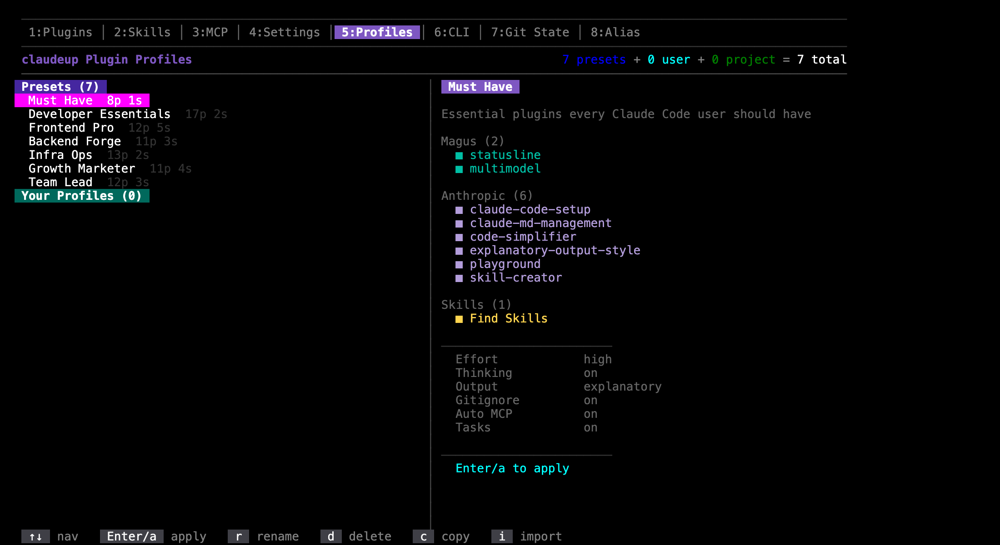

# Teams and profiles

Enabling the same plugins on two machines does not give you the same setup. A plugin can
declare binaries its MCP server shells out to, CLI tools, skills, and environment variables.
Miss one and the plugin loads, shows up in the list, and silently does nothing.

A **profile** is the whole closure written down: marketplaces, pinned plugins, MCP servers,
CLI tools, skills, settings, and which environment variables are required. Commit it, and a
teammate reproduces your setup with one command.

## Making one

You don't write the file. You set the project up the way you want it, and claudeup writes
down what you did.

**1. Get the project right.** Open claudeup, go to the Plugins tab (`1`), and toggle on what
this project needs. Add MCP servers (`3`) and skills (`2`) the same way.

```bash
claudeup
```

Or start from a preset instead of from scratch. The Profiles tab (`5`) ships seven, and each
one shows you everything it would install before you apply it.



**2. Save it as a profile.** Press `s` on the Plugins tab. Name it, and choose the scope:

| Scope | File | For |
|---|---|---|
| **Project** | `.claude/profiles.json` | The team. This is the one you commit |
| **User** | `~/.claude/profiles.json` | Just you, on this machine, everywhere |

**3. Commit it.**

```bash
git add .claude/profiles.json && git commit -m "chore: declare the team profile"
```

## The one command

Everyone else, forever after:

```bash
git clone <repo> && cd <repo>
claudeup install
```

That registers the marketplaces, installs the pinned plugins, installs the binaries those
plugins declare plus the profile's CLI tools, installs the skills, prompts for any required
environment variables, and activates the profile.

Not installed claudeup yet? See [Installing Magus](./install.md).

## Switching

```bash
claudeup profile list
claudeup profile switch backend
```

Or the Profiles tab, where `Enter` applies one. Switching repoints symlinks rather than
rewriting files, so it is fast and leaves no git diff.

## What is committed, and what is not

Only the manifest. Everything else is generated, like `node_modules`.

| Path | Committed | Written by |
|---|---|---|
| `.claude/profiles.json` | **yes** — the source of truth | claudeup, when you save a profile |
| `.claude/_profiles/<name>/` | no, gitignored | `claudeup install` |
| `.claude/settings.json` | no, gitignored | symlink into the active profile |
| `.mcp.json` | no, gitignored | symlink into the active profile |
| `.claude/skills/` | no, gitignored | symlink into the active profile |
| `.claude/settings.local.json` | no, gitignored | you — **credentials live here** |

Because switching repoints symlinks, one developer on `frontend` and another on `backend`
produce no git diff between them. `claudeup install` and `claudeup profile switch` add the
generated paths to `.gitignore` for you.

## What ends up in the file

claudeup writes it, so you mostly read it in a diff. A profile looks like this:

```json
{
  "profiles": {
    "frontend": {
      "extends": "developer-essentials",
      "plugins": { "dev@magus": "latest", "terminal@magus": "4.1.4" },
      "env": { "required": ["FIGMA_ACCESS_TOKEN"] }
    }
  }
}
```

A profile can also carry `mcpServers`, `cliTools`, `skills`, `settings`, and a
`marketplaces` block. Each maps to a tab in the TUI, so you get them by turning things on
there rather than by typing them.

Three things are worth knowing when you read a diff:

**`extends` starts from a built-in profile** and overrides it — `must-have`,
`developer-essentials`, `frontend-pro`, `backend-forge`, `infra-ops`, `growth-marketer`,
`team-lead`. A one-line profile that only sets `extends` is a working profile.

**`marketplaces` is usually absent, and that is correct.** A plugin id already names its
marketplace — `dev@magus` — and claudeup registers the ones it ships with. The block only
appears for a marketplace it does not know, or to point a name at a fork.

**`env` names variables, never values.** `claudeup install` prompts for them and writes them
to `.claude/settings.local.json`, which is personal and gitignored. Credentials never enter
the manifest.

Set `"strictVersions": true` at the top level to make `install --check` fail on any version
drift, rather than reporting it.

## Binaries come with the plugin

A plugin declares the binaries it needs in its own `plugin.json`, and claudeup resolves them
transitively. This is the part that plain plugin installation cannot do.

```bash
$ claudeup profile show backend
Profile: backend (Backend)
  marketplaces  magus
  plugins       terminal@magus
  cli tools     tmux-mcp@v1.6.3, tmux
```

A **dangling** binary counts as missing. `which` reports a symlink's own path even when its
target is gone, so claudeup follows the link and checks executability rather than trusting
`which`.

## More than one profile per repo

```bash
claudeup install              # materialize every profile, activate one
claudeup profile list         # ● marks the active one
claudeup profile switch backend
claudeup profile show backend
```

`switch` is offline and cheap: it repoints symlinks and verifies the profile's binaries are
present, warning rather than failing if any are missing.

Switching is **exclusive**. Each profile's generated `settings.json` names every plugin in
the manifest — its own as `true`, everyone else's as `false` — so switching to `backend`
actively disables the frontend plugins instead of leaving both sets on.

## Promoting local changes

Toggling something in the TUI changes **your** setup. It does not touch the manifest.

When you want a local change to become the team's, promote it:

```bash
claudeup profile sync
```

That writes your local state back into `.claude/profiles.json` so you can commit it.

**This step is deliberate, not an oversight.** The manifest is what the team agreed to; your
local setup is what you happen to have right now. Keeping them separate is what makes the
difference between them visible — and that difference is the whole point of
`claudeup install --check` below. If every toggle wrote itself into the manifest, there would
be no drift to detect, because the file would always agree with the machine it was last
touched on.

It also means trying a plugin for ten minutes does not put a change into a shared file you
have to remember to revert.

## Keeping CI honest

```bash
claudeup install --check
```

Reports drift and writes nothing. With `"strictVersions": true` a version that has floated
away from its pin fails the check. `claudeup doctor` also exits non-zero on a problem.

## Before you adopt profiles

Profiles make `.claude/skills` a symlink into the active profile and gitignore it. If your
repo **commits** skills there, two things follow:

1. **Nothing is lost locally.** The first `claudeup install` copies your existing
   `.claude/skills/*` into every profile before the swap.
2. **They stop being tracked.** A fresh clone has nothing to copy from, so a committed
   project skill does not reach teammates this way. If a skill must ship with the repo, put
   it in a plugin — a plugin skill is versioned, listed, and installed by the manifest.

If that trade is wrong for your repo, do not adopt profiles for it. The two models genuinely
conflict over who owns `.claude/skills`.
